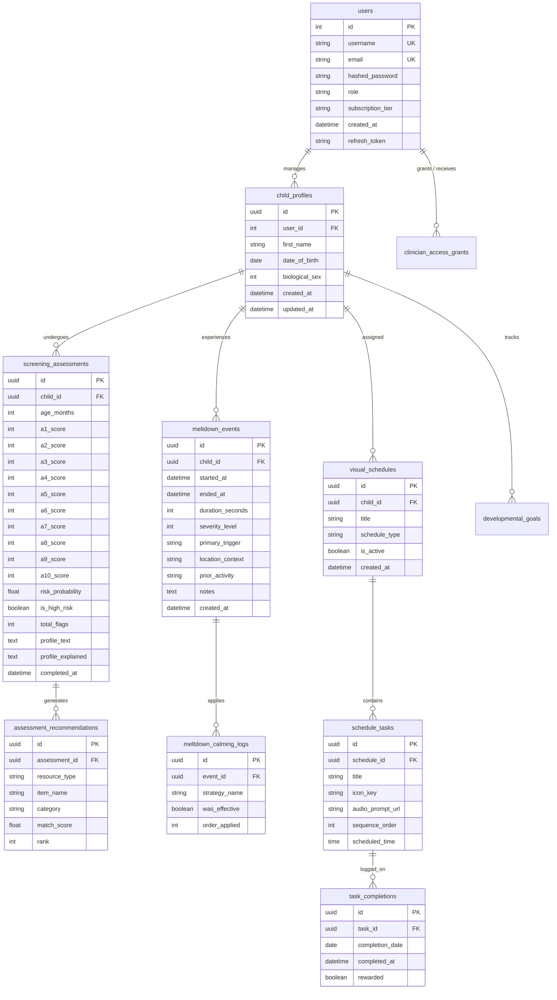
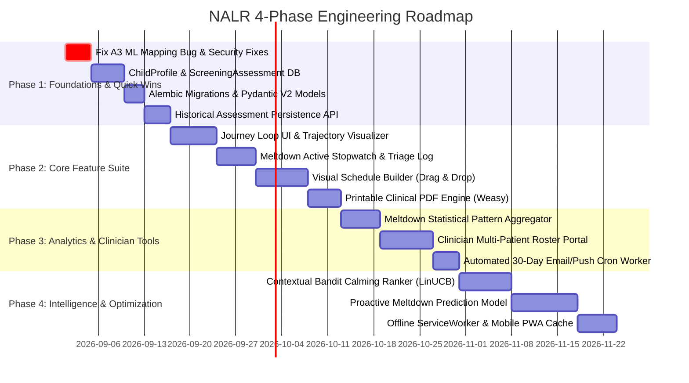

# NALR Product Gap Analysis & Technical Architecture Roadmap

**Platform:** Neuro-Adaptive ASD Learning Recommender (NALR)  
**Document Type:** Product Strategy, Technical Gap Analysis & Engineering Roadmap  
**Target Audience:** Founders, Product Managers, Lead Architects, and Machine Learning Engineers  
**Baseline Architecture:** FastAPI 2.0.0, SQLAlchemy 2.0 (PostgreSQL/SQLite), Scikit-Learn / XGBoost, Google Gemini 2.5 Flash, Jinja2 / Vanilla JS Presentation Layer.

---

## 1. Executive Strategy & Architectural Gap Overview

The initial audit established that NALR is currently a **stateless, single-session screening calculator**. While it possesses a solid ML inference baseline (XGBoost Q-CHAT-10 risk scoring and TF-IDF semantic recommendation) and role-based authentication (`parent`, `clinician`), it **retains zero screening records** in its database.

```
CURRENT ARCHITECTURE (Stateless Transactional Screener)
[Parent] ──> [Screening Form] ──> [XGBoost / TF-IDF] ──> [HTML Results Screen] ──> (Data Dropped on Navigation)

PROPOSED ARCHITECTURE (Longitudinal Pediatric ASD Operating System)
[Parent] ──> [Child Profiles] ──┬──> [30-Day Screening Loop] ──> [Trajectory & Trend Engine]
                                ├──> [Sensory Meltdown Toolkit] ──> [Pattern & Trigger ML]
                                └──> [Visual Schedule Builder]  ──> [Daily Retention & Task Engine]
```

To transition NALR into a **longitudinal pediatric management platform**, the application must evolve across four key dimensions:
1. **Relational Data Layer:** Transition from an isolated `users` table to a relational domain graph centered on `ChildProfile`, linking longitudinal assessments, sensory meltdown events, and daily visual routines.
2. **Event & Behavioral Telemetry:** Capture granular real-time event streams (timestamped timer ticks, routine completion milestones, calming intervention efficacy).
3. **Machine Learning Paradigm Shift:** Expand from cross-sectional static classification (`predict_risk`) to time-series trend forecasting, survival/hazard models for meltdown likelihood, and collaborative reinforcement for personalized calming strategies.
4. **Interactive Rich Client UI:** Transition high-frequency interactive tools (drag-and-drop schedule builders, active stopwatch timers) from server-rendered static templates into modular, reactive UI components with offline-first local storage sync.

---

## 2. Feature Fit & Gap Analysis

| Proposed Feature | Reusable Components | Missing Core Components | Technical Complexity |
| :--- | :--- | :--- | :--- |
| **1. My Child's Journey Loop** | • Likert mapping (`core.py`)<br>• XGBoost scoring (`predict_risk`)<br>• Recommendation TF-IDF pipeline<br>• User auth & `RoleChecker` | • `ChildProfile` & `Assessment` DB<br>• Delta & trajectory calculation<br>• PDF reporting pipeline<br>• Reminder & notification cron | **Medium** (Backend)<br>**Medium** (Frontend) |
| **2. Sensory Meltdown Tracker** | • Gemini Nora context injection<br>• Base CSS design tokens<br>• Evidence tagging heuristic | • Active stopwatch state machine<br>• Post-event intake modal/schema<br>• Event trigger analytics engine | **High** (Real-time)<br>**High** (ML Pattern) |
| **3. Visual Schedule Builder** | • Jinja2 layout base / navbar<br>• Role-based permissions<br>• Pydantic validation framework | • Drag-and-drop DOM canvas<br>• Media asset & icon CDN / bucket<br>• Gamification & streak engine | **High** (Frontend UX)<br>**Low** (Backend CRUD) |

### Feature 1: My Child's Journey Loop (Longitudinal Screening & Progress)
* **Architectural Alignment:** Directly extends the existing screening pipeline (`/predict`, `/recommend`, `results.html`).
* **Reusable Assets:**
  - Standard/Reverse Likert recoding functions in `core.py`.
  - Feature extraction and TF-IDF app/book recommendation engine.
  - User authorization dependency (`get_current_user`).
* **Missing Assets:**
  - `child_profiles` table (1:N with users) to decouple caregiver accounts from individual toddlers.
  - `screening_assessments` table to persist historical inputs ($A_1 \dots A_{10}$, age, sex, risk probability, flagged milestones).
  - Trend delta engine comparing Assessment $T_n$ against Assessment $T_{n-1}$.
  - Automated scheduling/notification worker to trigger 30-day reassessment reminders.
  - Headless PDF generation engine (e.g., WeasyPrint or Playwright) for clinical printable summaries.
* **Technical Risks:**
  - *Model Age Drift:* Toddlers age out of the Q-CHAT-10 instrument window ($>48$ months), causing model invalidation over extended multi-year monitoring.

### Feature 2: Sensory Meltdown Timer & Tracker
* **Architectural Alignment:** Extends the platform from screening into real-time clinical intervention. Integrates with the Nora Gemini AI assistant to supply calming tactics.
* **Reusable Assets:**
  - Gemini API client wrapper (`_init_gemini`) for dynamic calming strategy prompt generation.
  - Application logging and database session management.
* **Missing Assets:**
  - Client-side active timer state machine resilient to mobile screen locks and app backgrounding.
  - `meltdown_events` and `calming_strategies` relational tables.
  - Statistical aggregation queries to surface environmental pattern correlations (e.g., day-of-week, time-of-day, location).
  - Data privacy/HIPAA-compliant sanitization for free-text trigger descriptions.
* **Technical Risks:**
  - *Emergency UX Friction:* A parent managing an active meltdown cannot navigate complex multi-step forms. The interface must be a 1-tap activation with zero cognitive overhead.

### Feature 3: Visual Schedule Builder
* **Architectural Alignment:** Acts as the primary daily-active-use (DAU) retention mechanism, converting NALR from a monthly utility into an everyday routine anchor.
* **Reusable Assets:**
  - Static asset serving and Pydantic schema validation pipeline.
  - User role checks (`parent` vs. `clinician`).
* **Missing Assets:**
  - `visual_schedules` and `schedule_tasks` database entities with ordering/sequence indices.
  - Dedicated icon and audio asset pipeline (accessible SVG vector library for pediatric non-verbal communication).
  - Drag-and-drop touch interface optimized for tablets and mobile devices.
  - Completion state tracking, audio-visual reward triggers (confetti, chimes), and streak counter.
* **Technical Risks:**
  - *Frontend Bloat:* Heavy drag-and-drop frameworks can degrade mobile browser performance if not built with vanilla lightweight web components or clean DOM manipulation.

---

## 3. Product & Business Impact Analysis

| Metric / Impact Domain | My Child's Journey Loop | Sensory Meltdown Tracker | Visual Schedule Builder |
| :--- | :--- | :--- | :--- |
| **Primary Retention Metric** | 30-Day MAU Retention | Weekly / Incident-Based WAU | Daily Active Users (DAU / MAU) |
| **Clinical Utility** | High (Developmental Trajectory) | High (Trigger Analysis) | Medium (Behavioral Structuring) |
| **Monetization Opportunity** | B2B Clinical Tier / PDF Export | Premium Emergency Telehealth | In-App Asset Packs & Subscriptions |
| **Proprietary Data Asset** | Longitudinal Milestone Matrix | Real-World Sensory Incident Log | Daily Routine Adherence Matrix |
| **Competitive Moat** | High (Switching cost of data) | Very High (Unique Clinical IP) | Medium (Feature Parity with AAC) |

### Strategic Value Drivers
1. **Clinical Legitimacy & Pediatric Buy-In:** Pediatricians and developmental psychologists discard one-off self-reported quizzes. Providing longitudinal trajectories (Journey Loop) and time-stamped incident logs (Meltdown Tracker) transforms NALR into an indispensable clinical companion tool.
2. **Expansion to B2B Clinician Licensing:** Clinicians can monitor a roster of pediatric patients, track intervention outcomes across therapies (ABA, Speech, OT), and download formatted developmental reports before clinical visits.
3. **Data Flywheel:** As parents track sensory triggers and visual routine adherence, NALR builds a multimodal behavioral dataset capable of training predictive intervention models.

---

## 4. Comprehensive Data Architecture & Schema Review

### 4.1 Entity Relationship Diagram (Target Data Model)



### 4.2 Relational Schema Specifications (SQLAlchemy / PostgreSQL)

```python
# fastapi_app/models/domain_models.py
import uuid
from datetime import datetime, timezone, date, time
from sqlalchemy import (
    Column, Integer, String, Boolean, Float, DateTime, Date, Time, 
    ForeignKey, Text, UUID
)
from sqlalchemy.orm import relationship
from database import Base

class ChildProfile(Base):
    __tablename__ = "child_profiles"

    id = Column(UUID(as_uuid=True), primary_key=True, default=uuid.uuid4, index=True)
    user_id = Column(Integer, ForeignKey("users.id", ondelete="CASCADE"), nullable=False, index=True)
    first_name = Column(String(50), nullable=False)
    date_of_birth = Column(Date, nullable=False)
    biological_sex = Column(Integer, nullable=False) # 1 = Male, 0 = Female
    created_at = Column(DateTime, default=lambda: datetime.now(timezone.utc), nullable=False)
    updated_at = Column(DateTime, default=lambda: datetime.now(timezone.utc), onupdate=lambda: datetime.now(timezone.utc), nullable=False)

    # Relationships
    user = relationship("User", backref="children")
    assessments = relationship("ScreeningAssessment", back_populates="child", cascade="all, delete-orphan", order_by="ScreeningAssessment.completed_at.desc()")
    meltdowns = relationship("MeltdownEvent", back_populates="child", cascade="all, delete-orphan")
    schedules = relationship("VisualSchedule", back_populates="child", cascade="all, delete-orphan")


class ScreeningAssessment(Base):
    __tablename__ = "screening_assessments"

    id = Column(UUID(as_uuid=True), primary_key=True, default=uuid.uuid4, index=True)
    child_id = Column(UUID(as_uuid=True), ForeignKey("child_profiles.id", ondelete="CASCADE"), nullable=False, index=True)
    age_months = Column(Integer, nullable=False)
    
    # Q-CHAT-10 Scores (0-4 Ordinal Recodes)
    a1_score = Column(Integer, nullable=False)
    a2_score = Column(Integer, nullable=False)
    a3_score = Column(Integer, nullable=False)
    a4_score = Column(Integer, nullable=False)
    a5_score = Column(Integer, nullable=False)
    a6_score = Column(Integer, nullable=False)
    a7_score = Column(Integer, nullable=False)
    a8_score = Column(Integer, nullable=False)
    a9_score = Column(Integer, nullable=False)
    a10_score = Column(Integer, nullable=False)
    
    risk_probability = Column(Float, nullable=False)
    is_high_risk = Column(Boolean, nullable=False)
    total_flags = Column(Integer, nullable=False)
    profile_text = Column(Text, nullable=False)
    profile_explained = Column(Text, nullable=True)
    completed_at = Column(DateTime, default=lambda: datetime.now(timezone.utc), nullable=False, index=True)

    child = relationship("ChildProfile", back_populates="assessments")
    recommendations = relationship("AssessmentRecommendation", back_populates="assessment", cascade="all, delete-orphan")


class AssessmentRecommendation(Base):
    __tablename__ = "assessment_recommendations"

    id = Column(UUID(as_uuid=True), primary_key=True, default=uuid.uuid4)
    assessment_id = Column(UUID(as_uuid=True), ForeignKey("screening_assessments.id", ondelete="CASCADE"), nullable=False, index=True)
    resource_type = Column(String(20), nullable=False) # 'app' or 'book'
    item_name = Column(String(255), nullable=False)
    category = Column(String(100), nullable=True)
    match_score = Column(Float, nullable=False)
    rank = Column(Integer, nullable=False)

    assessment = relationship("ScreeningAssessment", back_populates="recommendations")


class MeltdownEvent(Base):
    __tablename__ = "meltdown_events"

    id = Column(UUID(as_uuid=True), primary_key=True, default=uuid.uuid4, index=True)
    child_id = Column(UUID(as_uuid=True), ForeignKey("child_profiles.id", ondelete="CASCADE"), nullable=False, index=True)
    started_at = Column(DateTime, nullable=False)
    ended_at = Column(DateTime, nullable=False)
    duration_seconds = Column(Integer, nullable=False)
    severity_level = Column(Integer, nullable=False) # 1 (Mild) to 5 (Severe)
    primary_trigger = Column(String(100), nullable=False) # 'Loud Noise', 'Sensory Overload', 'Transition', etc.
    location_context = Column(String(100), nullable=True) # 'Home', 'Classroom', 'Supermarket', etc.
    prior_activity = Column(String(150), nullable=True)
    notes = Column(Text, nullable=True)
    created_at = Column(DateTime, default=lambda: datetime.now(timezone.utc), nullable=False)

    child = relationship("ChildProfile", back_populates="meltdowns")
    calming_logs = relationship("MeltdownCalmingLog", back_populates="event", cascade="all, delete-orphan")


class MeltdownCalmingLog(Base):
    __tablename__ = "meltdown_calming_logs"

    id = Column(UUID(as_uuid=True), primary_key=True, default=uuid.uuid4)
    event_id = Column(UUID(as_uuid=True), ForeignKey("meltdown_events.id", ondelete="CASCADE"), nullable=False, index=True)
    strategy_name = Column(String(150), nullable=False) # e.g. "Dim lights", "Deep pressure"
    was_effective = Column(Boolean, nullable=False)
    order_applied = Column(Integer, nullable=False)

    event = relationship("MeltdownEvent", back_populates="calming_logs")


class VisualSchedule(Base):
    __tablename__ = "visual_schedules"

    id = Column(UUID(as_uuid=True), primary_key=True, default=uuid.uuid4, index=True)
    child_id = Column(UUID(as_uuid=True), ForeignKey("child_profiles.id", ondelete="CASCADE"), nullable=False, index=True)
    title = Column(String(100), nullable=False) # e.g. "Morning Routine", "Bedtime"
    schedule_type = Column(String(50), default="daily", nullable=False)
    is_active = Column(Boolean, default=True, nullable=False)
    created_at = Column(DateTime, default=lambda: datetime.now(timezone.utc), nullable=False)

    child = relationship("ChildProfile", back_populates="schedules")
    tasks = relationship("ScheduleTask", back_populates="schedule", cascade="all, delete-orphan", order_by="ScheduleTask.sequence_order.asc()")


class ScheduleTask(Base):
    __tablename__ = "schedule_tasks"

    id = Column(UUID(as_uuid=True), primary_key=True, default=uuid.uuid4)
    schedule_id = Column(UUID(as_uuid=True), ForeignKey("visual_schedules.id", ondelete="CASCADE"), nullable=False, index=True)
    title = Column(String(100), nullable=False)
    icon_key = Column(String(50), nullable=False) # e.g. "brush_teeth", "breakfast"
    audio_prompt_url = Column(String(255), nullable=True)
    sequence_order = Column(Integer, nullable=False)
    scheduled_time = Column(Time, nullable=True)

    schedule = relationship("VisualSchedule", back_populates="tasks")
    completions = relationship("TaskCompletion", back_populates="task", cascade="all, delete-orphan")


class TaskCompletion(Base):
    __tablename__ = "task_completions"

    id = Column(UUID(as_uuid=True), primary_key=True, default=uuid.uuid4)
    task_id = Column(UUID(as_uuid=True), ForeignKey("schedule_tasks.id", ondelete="CASCADE"), nullable=False, index=True)
    completion_date = Column(Date, default=lambda: datetime.now(timezone.utc).date(), nullable=False, index=True)
    completed_at = Column(DateTime, default=lambda: datetime.now(timezone.utc), nullable=False)
    rewarded = Column(Boolean, default=True, nullable=False)

    task = relationship("ScheduleTask", back_populates="completions")
```

---

## 5. API Architecture & Endpoint Contracts

### 5.1 Route Hierarchy & Versioning Strategy
All new endpoints will be versioned under `/api/v1` to decouple them from the server-rendered HTML routes (`/`, `/screen`, `/apps-page`) while maintaining full backwards compatibility.

```
/api/v1
├── /children                      (Child Profile CRUD)
│   ├── POST   /
│   ├── GET    /
│   ├── GET    /{child_id}
│   ├── PUT    /{child_id}
│   └── DELETE /{child_id}
│
├── /journey                       (Longitudinal Assessment Engine)
│   ├── POST   /{child_id}/screen
│   ├── GET    /{child_id}/history
│   ├── GET    /{child_id}/trajectory
│   └── GET    /{child_id}/report.pdf
│
├── /meltdowns                     (Emergency Tracker & History)
│   ├── GET    /{child_id}/toolkit
│   ├── POST   /{child_id}/events
│   ├── GET    /{child_id}/analytics
│   └── GET    /{child_id}/events
│
└── /schedules                     (Visual Routine Builder & Execution)
    ├── POST   /{child_id}
    ├── GET    /{child_id}
    ├── PUT    /{schedule_id}/tasks/reorder
    └── POST   /tasks/{task_id}/complete
```

### 5.2 Endpoint Specifications

#### 1. Longitudinal Trajectory API
* **Route:** `GET /api/v1/journey/{child_id}/trajectory`
* **Auth:** Bearer Token (`parent` or `clinician` authorized for `child_id`).
* **Response Contract:**
```json
{
  "child_id": "9b1deb4d-3b7d-4bad-9bdd-2b0d7b3dcb6d",
  "child_name": "Leo",
  "total_assessments": 3,
  "trend_direction": "improving",
  "baseline_risk": 78.4,
  "current_risk": 48.2,
  "risk_delta": -30.2,
  "assessments_timeline": [
    {
      "assessment_id": "f47ac10b-58cc-4372-a567-0e02b2c3d479",
      "date": "2026-06-01T10:30:00Z",
      "age_months": 24,
      "risk_probability": 78.4,
      "total_flags": 7,
      "flagged_domains": ["speech", "eye_contact", "pointing"],
      "top_recommended_app": "Proloquo2Go"
    },
    {
      "assessment_id": "a1b2c3d4-e5f6-7a8b-9c0d-1e2f3a4b5c6d",
      "date": "2026-07-02T09:15:00Z",
      "age_months": 25,
      "risk_probability": 61.0,
      "total_flags": 5,
      "flagged_domains": ["speech", "pointing"],
      "top_recommended_app": "Otsimo"
    },
    {
      "assessment_id": "c7d8e9f0-1a2b-3c4d-5e6f-7a8b9c0d1e2f",
      "date": "2026-08-03T11:45:00Z",
      "age_months": 26,
      "risk_probability": 48.2,
      "total_flags": 4,
      "flagged_domains": ["speech"],
      "top_recommended_app": "Speech Blubs"
    }
  ],
  "domain_improvements": {
    "eye_contact": "Resolved",
    "pointing": "Partial Improvement",
    "speech": "Ongoing Focus Area"
  }
}
```

#### 2. Meltdown Log & Calming Strategies API
* **Route:** `POST /api/v1/meltdowns/{child_id}/events`
* **Request Contract:**
```json
{
  "started_at": "2026-08-31T17:15:00Z",
  "ended_at": "2026-08-31T17:32:00Z",
  "duration_seconds": 1020,
  "severity_level": 4,
  "primary_trigger": "Loud noise / Blender",
  "location_context": "Kitchen",
  "prior_activity": "Preparing dinner",
  "notes": "Covered ears, dropped to floor, high agitation.",
  "calming_strategies": [
    { "strategy_name": "Move to quiet bedroom", "was_effective": true, "order_applied": 1 },
    { "strategy_name": "Weighted lap pad", "was_effective": true, "order_applied": 2 },
    { "strategy_name": "Verbal soothing", "was_effective": false, "order_applied": 3 }
  ]
}
```

#### 3. Task Completion & Streak API
* **Route:** `POST /api/v1/schedules/tasks/{task_id}/complete`
* **Response Contract:**
```json
{
  "task_id": "4a5b6c7d-8e9f-0a1b-2c3d-4e5f6a7b8c9d",
  "completion_date": "2026-08-31",
  "status": "completed",
  "streak_days": 12,
  "reward_animation": "stars_confetti",
  "audio_chime_url": "/static/audio/rewards/cheerful_bell.mp3"
}
```

---

## 6. Machine Learning Roadmap

| Horizon | ML Objective | Model Architecture | Data Requirements | Success Metrics |
| :--- | :--- | :--- | :--- | :--- |
| **Short-Term**<br>(Months 1–2) | Trajectory Delta & Flag Shifts;<br>Meltdown Statistical Clustering | Rule-based Domain Recoding + Pandas Moving Averages | Longitudinal Q-CHAT-10 DB records ($N \ge 2/\text{child}$) | 100% Deterministic Flag Reconciliation |
| **Medium-Term**<br>(Months 3–5) | Meltdown Risk Forecasting;<br>Calming Strategy Ranking | Gradient Boosted Decision Trees (XGBoost/LightGBM) + Contextual LinUCB | Meltdown logs, timestamps, environmental context | ROC-AUC $\ge 0.82$;<br>Top-2 Calming Hit Rate $> 75\%$ |
| **Long-Term**<br>(Months 6+) | Developmental Progression Trajectory Modeling | Deep Temporal / LSTM or Hierarchical Bayesian Trajectory | Multimodal: Screenings + Daily Routines + Incidents | Trajectory RMSE $< 5\%$;<br>Clinician Utility $> 85\%$ |

### 6.1 Short-Term (Months 1–2): Trajectory Delta Engine & Statistical Pattern Miner
* **Longitudinal Screening Delta:**
  - The current static XGBoost model (`asd_ordinal_top10_model.pkl`) is retained for instantaneous point-in-time probability calculation.
  - A deterministic delta calculator measures:
    $$\Delta \text{Risk} = \text{Risk}_{T_n} - \text{Risk}_{T_{n-1}}$$
    $$\text{Flag Transition Matrix} = \{A_i \mid A_i(T_{n-1}) \ge 3 \land A_i(T_n) < 3\}$$
* **Meltdown Pattern Detection:**
  - Computes non-parametric bivariate distributions across time-of-day (4-hour bins), day-of-week, and location tags.
  - Automatically synthesizes plain-English insights (e.g., *"67% of sensory incidents occur on weekdays between 3:00 PM and 6:00 PM in kitchen/dining environments"*).

### 6.2 Medium-Term (Months 3–5): Predictive Meltdown Scoring & Contextual Bandits
* **Contextual Calming Bandit (Multi-Armed Bandit):**
  - Uses contextual LinUCB (Linear Upper Confidence Bound) to dynamically re-order calming toolkit suggestions during an active meltdown based on child traits, location, and historical strategy effectiveness.
* **Proactive Warning Engine:**
  - Evaluates routine adherence and environmental context to dispatch pre-meltdown prompts to parents (e.g., *"Transition ahead: Visual schedule indicates School -> Grocery Store. Sensory triggers high. Consider preparing noise-canceling headphones"*).

### 6.3 Long-Term (Months 6+): Multimodal Developmental Forecasting
* **Hierarchical Bayesian Trajectory Modeling:**
  - Models individual child milestone acquisition curves over 12–36 months, estimating true intervention velocity while controlling for natural age maturation.

---

## 7. UI/UX Architecture & User Journey Workflows

### 7.1 Site Map & Screen Inventory

```
NALR Application Shell
├── /login & /register              (Existing - Cookie/Session Auth)
├── /dashboard                      [NEW] (Child Overview & Central Hub)
│
├── /journey                        [NEW] (Journey Loop Hub)
│   ├── /journey/{child_id}/screener     (30-Day Stepped Questionnaire)
│   ├── /journey/{child_id}/timeline     (Interactive SVG Risk Trajectory)
│   └── /journey/{child_id}/report       (Printable Clinical PDF View)
│
├── /meltdown                       [NEW] (Sensory Toolkit & Log)
│   ├── /meltdown/{child_id}/active      (Emergency 1-Tap Stopwatch & Quick Aids)
│   ├── /meltdown/{child_id}/intake      (Post-Event Triage Modal)
│   └── /meltdown/{child_id}/analytics   (Trigger Breakdown Charts & Heatmaps)
│
└── /schedule                       [NEW] (Visual Routine Hub)
    ├── /schedule/{child_id}/builder     (Drag-and-Drop Editor & Icon Palette)
    └── /schedule/{child_id}/live        (Child-Friendly Visual Checklist & Audio)
```

### 7.2 Core User Journey: The Emergency Meltdown Flow

```
[Meltdown Starts]
       │
       ▼
[Tap Prominent Topbar Button: "🚨 Meltdown Active"]  <-- 1 Tap from any screen
       │
       ▼
┌─────────────────────────────────────────────────────────────┐
│ ACTIVE STOPWATCH SCREEN                                     │
│  ⏱️ 02:45 (Large high-contrast display)                     │
│                                                             │
│  Recommended Calming Actions for Leo:                       │
│  [1] 💡 Dim lights & reduce noise                           │
│  [2] 🧸 Provide weighted lap pad                            │
│  [3] 🎧 Offer noise-canceling headphones                    │
│                                                             │
│  [ ✅ Stop & Record Event ]                                 │
└─────────────────────────────────────────────────────────────┘
       │
       ▼ (Parent taps Stop)
┌─────────────────────────────────────────────────────────────┐
│ 2-MINUTE POST-INCIDENT LOG (Quick Select Chips)             │
│  Duration: 8m 14s                                           │
│  Trigger:  [Loud Noise] [Transition] [Hunger] [Screen Off]  │
│  Location: [Home] [Store] [Car] [School]                    │
│  What worked: [x] Weighted Pad  [x] Quiet Room              │
│                                                             │
│  [ Save to Child Log ]                                      │
└─────────────────────────────────────────────────────────────┘
```

---

## 8. Phased Implementation Roadmap



### Detailed Phase Specifications

#### Phase 1: Foundations, Security & Historical Persistence (Weeks 1–2)
* **Objectives:** Clean technical debt from the audit, establish multi-child relational persistence, and implement Alembic migrations.
* **Dependencies:** None.
* **Deliverables:**
  1. Fix `A3` variable omission in `core.py:predict_risk`.
  2. Implement `ChildProfile`, `ScreeningAssessment`, and `AssessmentRecommendation` SQLAlchemy models.
  3. Initialize Alembic migration environment (`alembic revision --autogenerate`).
  4. Build `/api/v1/children` and `/api/v1/journey/{child_id}/screen` endpoints.
  5. Convert authentication cookies to `HttpOnly; Secure; SameSite=Lax`.

#### Phase 2: Core Feature Suite (Weeks 3–5)
* **Objectives:** Launch the user-facing Journey Loop timeline, Meltdown Emergency Stopwatch, and Visual Schedule Builder.
* **Dependencies:** Phase 1 database entities and authenticated child sessions.
* **Deliverables:**
  1. Interactive SVG trajectory chart component displaying risk scores over time.
  2. Meltdown emergency UI drawer with active timer and post-incident tagging modal.
  3. Visual Schedule Builder with task reordering and daily check-off streak animation.
  4. Headless PDF generation service rendering printable clinical assessment reports.

#### Phase 3: Advanced Analytics & Clinician Portal (Weeks 6–8)
* **Objectives:** Equip clinicians with multi-patient monitoring tools and provide parents with environmental trigger insights.
* **Dependencies:** Phase 2 telemetry collection.
* **Deliverables:**
  1. Clinician dashboard supporting multi-child roster view and comparative analytics.
  2. Trigger correlation engine grouping meltdown events by time, environment, and prior activity.
  3. Background task runner (e.g., Celery/Redis or APScheduler) triggering 30-day reassessment reminders.

#### Phase 4: ML-Powered Intelligence & PWA Optimization (Weeks 9–11)
* **Objectives:** Deploy predictive models and optimize mobile client experience.
* **Dependencies:** Historical incident volume ($N \ge 500$ logged events across platform).
* **Deliverables:**
  1. Multi-Armed Bandit algorithm optimizing calming strategy order per child profile.
  2. Meltdown probability forecasting model based on schedule deviations and sensory load.
  3. Progressive Web App (PWA) manifest and ServiceWorker caching for offline visual schedule execution.

---

## 9. Final Strategic Recommendations

### 9.1 Strategic Prioritization Matrix

```
       HIGH VALUE │
                  │     [1] Journey Loop (Build 1st)
                  │           ★ Fastest Time to Market & High Clinical Moat
                  │
                  │     [3] Visual Schedule Builder (Build 2nd)
                  │           ★ Drives Daily Retention (DAU)
                  │
                  │     [2] Sensory Meltdown Tracker (Build 3rd)
                  │           ★ High Value, Requires UX Simplicity
                  │
        LOW VALUE │
                  └───────────────────────────────────────────────
                    LOW COMPLEXITY                 HIGH COMPLEXITY
```

### 9.2 Critical Strategic Answers

1. **Should all three features be built?**
   - **Yes.** The three features form a complementary retention and clinical flywheel:
     - **Visual Schedules** $\rightarrow$ Drives **Daily Active Use (DAU)**.
     - **Meltdown Tracker** $\rightarrow$ Drives **High-Value Acute Utility & Incident Data**.
     - **Journey Loop** $\rightarrow$ Drives **Monthly Retention (MAU) & Clinical Monetization**.

2. **Which feature delivers the highest business value?**
   - **My Child's Journey Loop.** It creates high switching costs (longitudinal health records cannot be easily migrated), unlocks B2B clinical licensing, and validates treatment efficacy for insurance or therapy providers.

3. **Which feature delivers the fastest time-to-market?**
   - **My Child's Journey Loop.** It reuses 85% of existing ML and scoring pipelines (`core.py`, `schemas/recommend.py`), requiring only data persistence and a timeline UI.

4. **Recommended Implementation Sequence:**
   1. **Foundational Refactoring & DB Persistence** (Week 1–2).
   2. **My Child's Journey Loop** (Week 3–4).
   3. **Visual Schedule Builder** (Week 5–6).
   4. **Sensory Meltdown Tracker** (Week 7–8).
   5. **ML Intelligence & Predictive Analytics** (Week 9+).

### 9.3 Risk Register & Mitigation Strategy

| Risk Factor | Severity | Likelihood | Mitigation Strategy |
| :--- | :--- | :--- | :--- |
| **Toddler Age Model Invalidation**<br>*(Aging out past 48 months)* | **High** | **High** | Cap Q-CHAT scoring at 48 months; transition older children to SCQ / Social Responsiveness Scale (SRS-2) models when child reaches 4 years. |
| **Emergency Meltdown Abandonment**<br>*(UX friction during crisis)* | **High** | **Medium** | Minimize timer UI to 1 button; enable offline caching and post-event push notification to complete details later when child is calm. |
| **HIPAA / PHI Compliance Risk**<br>*(Health & behavioral records)* | **High** | **Medium** | Encrypt child PII at rest (AES-256); store child names as pseudonymized tokens; enforce strict row-level tenant access policies in DB. |
| **Drag-and-Drop Mobile Latency** | **Medium** | **High** | Avoid heavy third-party UI libraries; implement touch-optimized HTML5 native pointer events and optimistic local state updates. |
